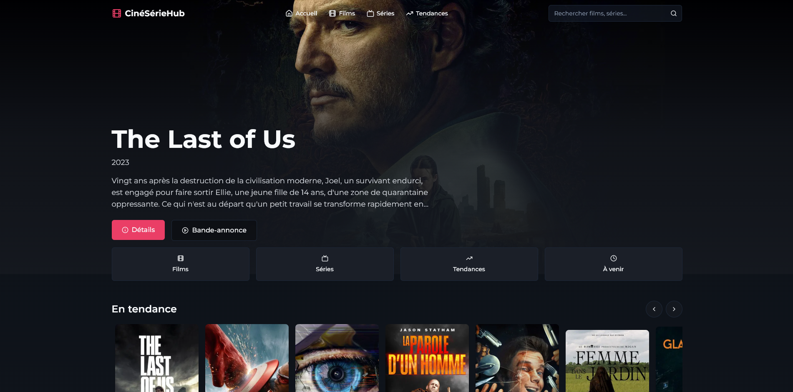

# 🎬 CinéSérieHub – Découvrez le monde du cinéma et des séries TV

**CinéSérieHub** est une application web moderne qui permet aux utilisateurs d’explorer un large catalogue de films et séries TV.  
Grâce à une interface élégante et intuitive, plongez dans l’univers du cinéma et restez à jour sur les tendances, les nouveautés, et les meilleures productions audiovisuelles.

---

## 🔗 Démo

Accédez à l'application en ligne :  
🍿 [CinéSérieHub](https://cineseriehub.netlify.app/)

---

## 🖼️ Aperçu

  
*Des captures d'écran seront ajoutées prochainement pour illustrer l’interface.*

---

## ✨ Fonctionnalités principales

- 🔍 **Recherche avancée** : Films, séries, mots-clés…
- 🎯 **Classements dynamiques** : Par popularité, notes, tendances ou dates de sortie
- 📆 **Sorties à venir** : Ne manquez pas les nouveautés à venir
- 📱 **Design responsive** : Une expérience fluide sur tous les appareils
- 🌐 **Navigation simple** : Accès rapide aux catégories et aux fiches détaillées

---

## 🛠️ Technologies utilisées

### 🔧 Frontend
- 
- 
- 

### 🎨 UI & Design
- 
- 

### 📡 Données & API
- 🎬 [The Movie Database (TMDB)](https://www.themoviedb.org/) API
- 

---

## 🎬 Installation locale

```bash
# Cloner le dépôt
git clone https://github.com/votre-utilisateur/cineseriehub.git

# Aller dans le dossier du projet
cd cineseriehub

# Installer les dépendances
npm install

# Lancer le serveur de développement
npm run dev
```

## 🌐 Variables d'Environnement

Créez un fichier `.env` à la racine du projet et ajoutez :
```
VITE_TMDB_API_KEY=votre_cle_api_tmdb
```
🔐 Vous pouvez obtenir votre clé gratuitement sur [developer.themoviedb.org](https://developer.themoviedb.org/)

## 🤝 Contribution

Les contributions sont les bienvenues ! N'hésitez pas à ouvrir une issue ou à proposer une pull request.

## 📄 Licence

Ce projet est sous licence MIT - voir le fichier [LICENSE](LICENSE) pour plus de détails.